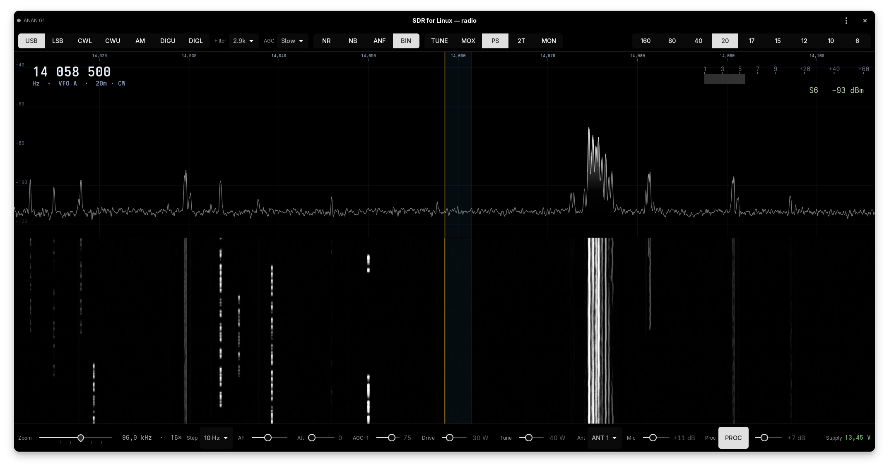

# SDR for Linux

**A modern GTK4 software-defined-radio application for HPSDR / ANAN
transceivers, built on the proven piHPSDR engine with a new, high-detail
user interface.**

`sdr-for-linux` is a GPLv3 fork-in-spirit of
[piHPSDR](https://github.com/dl1ycf/pihpsdr): it reuses piHPSDR's excellent
*engine* — the HPSDR Protocol 2 radio link and the WDSP DSP library — and
replaces the front-end with a native GTK4/libadwaita control surface and a
full-resolution floating-point panadapter. **No DSP is reimplemented**; WDSP
does the heavy lifting.

> **Status: 0.x — young but real.** Everything below is implemented and
> verified live on an Apache Labs **ANAN G2E**, an **ANAN 10E** and a
> **Hermes Lite 2** (all RX + TX), including a full CW contest deployment;
> see [Supported hardware](#supported-hardware).



## Features

**Receive**
- Full-float panadapter + waterfall straight from the WDSP analyzer — no
  quantisation, no column cap; 6 colour palettes, adjustable averaging & FPS
- SSB / CW / AM / SAM / DIGU / DIGL demodulation with piHPSDR filter presets,
  passband drawn on the spectrum
- AGC, noise reduction (ANR), noise blanker (ANB), auto-notch (ANF),
  binaural mode
- Low-latency native **PipeWire** audio (~15 ms), 48/96/192 kHz
- Scroll/drag/click-to-tune, octave-snap zoom, band buttons, band-plan
  overlay (IARU R1/R2/R3 + country overrides), DX-spot overlay with
  click-to-tune
- CW BFO offset done right: the dial reads the carrier, spots sound at your
  sidetone pitch

**Transmit** (SSB voice, CW, digi via TCI)
- MOX / TUNE with separate drive levels, per-band PA calibration,
  true-PEP wattmeter, SWR metering with automatic drive-drop protection
- Mic via PipeWire with mic gain / noise gate / speech processor controls
  (digi audio stays a bit-exact clean chain, enforced by the engine),
  faithful TX monitor (plays the processed on-air audio), footswitch PTT
- CW keying with clean first-dit and contest-grade latency (TCI→RF
  ~35 ms, turnaround ~200 ms), adjustable WPM / sidetone / break-in hang;
  mode-aware TX HUD (CW sent-text with playhead, digi TX level)
- **PureSignal** linearization with Thetis-style auto-attenuate — calibrates
  continuously on voice, converges in seconds after drive/band changes
  (G2E and Hermes Lite 2; not available on old Hermes-class P2 firmware —
  see the hardware table)
- TX panadapter + waterfall of the transmitted spectrum

**Integration**
- **TCI server** (ExpertSDR3-compatible, port 40001): control, CW macros,
  RX audio, TX audio (digimodes), wideband IQ, spots — verified live with
  **SDC**, **CW Skimmer** and **Decodium** (complete FT8 QSOs on the air)
- CAT/hamlib applications are covered through the third-party
  [tciadapter](https://github.com/ftl/tciadapter) bridge (WSJT-X, fldigi,
  CQRLOG verified by its author) — no serial-port emulation needed here

## Supported hardware

**Policy: a radio model is enabled only after it has been tested on real
hardware.** A wrong relay or filter bit in the HPSDR control words can
physically damage a PA, so untested models are refused by a whitelist in the
radio picker rather than left to luck.

| Radio | Protocol | Status |
|---|---|---|
| Apache Labs **ANAN G2E** | HPSDR Protocol 2 | ✅ supported, developed & verified on this radio |
| Apache Labs **ANAN 10E / 100B** (Hermes) | HPSDR Protocol 2 | ✅ supported — RX + TX live-verified (fw 10.3); per-radio PA calibration & 10 W scale. **PureSignal disabled**: the old Hermes firmware locks up on the P2 feedback-DDC switch mid-TX (power-cycle recovery); details in `docs/TX-DESIGN.md` §9 |
| **Hermes Lite 2** | HPSDR Protocol 1 | ✅ supported — **RX + TX + PureSignal live-verified** (gw 73.2): panadapter, audio, LNA gain (−12..+48 dB), N2ADR filter-board band switching, die temperature + 60 °C thermal TX trip, ADC-overload badge, TCI/SDC skimming, 5 W PA with per-band calibration (20 m calibrated, other bands under-drive until walked in), CW/voice, PureSignal over P1 (RX3/RX4 feedback; PS needs a sample rate ≤ 192 kHz). Rates 48–384 kHz, 0–38.4 MHz |
| Other ANAN / Hermes P2 boards | Protocol 2 | ⛔ blocked until tested — open an issue if you can lend hardware + a dummy load |
| Older P1 boards (HL1, Metis…) | Protocol 1 | ⛔ blocked until tested |

Each radio keeps its **own TX calibration** (PA calibration per band, wattmeter
trim, drive/antenna/PA-enable) in its own config section — calibrating one
model never touches another. A newly connected TX-capable model starts safe:
PA off, ANT1, 1 W.

## Requirements

- A supported ANAN radio on your LAN (see above)
- Linux with **PipeWire** as the sound server (standard on 2024+ distros)
- For the AppImage: glibc ≥ 2.39 (Ubuntu 24.04+, Fedora 40+, Mint 22,
  openSUSE, Arch, …)

## Install

Grab the latest from
[Releases](https://github.com/OK1BR/sdr-for-linux/releases) — three
formats, pick one:

**AppImage** (any distro, glibc ≥ 2.39):

```sh
chmod +x SDR_for_Linux-*.AppImage
./SDR_for_Linux-*.AppImage
```

**.deb** (Ubuntu 24.04+ / Debian 13+ / Mint 22+):

```sh
sudo apt install ./sdr-for-linux_*_amd64.deb
```

**.rpm** (Fedora 40+):

```sh
sudo dnf install ./sdr-for-linux-*.x86_64.rpm
```

Both packages are install-tested in fresh containers by the release CI.

**Arch Linux (AUR)** — planned; blocked for now on AUR's upstream freeze of
new-account registrations (June 2026 malware cleanup). Meanwhile the
AppImage runs fine on Arch, or build from source below —
`packaging/PKGBUILD` works locally with `makepkg`.

**Build from source** — the DSP engine (**WDSP**, plus **rnnoise** and
**libspecbleach**) is vendored in `vendor/` and built from source; only
ubiquitous platform libraries come from your distribution:

| Need | Arch | Debian/Ubuntu | Fedora |
|---|---|---|---|
| GTK4 + libadwaita ≥ 1.5 | `gtk4 libadwaita` | `libgtk-4-dev libadwaita-1-dev` | `gtk4-devel libadwaita-devel` |
| FFTW (single + double) | `fftw` | `libfftw3-dev` | `fftw-devel` |
| PipeWire client | `libpipewire` | `libpipewire-0.3-dev` | `pipewire-devel` |
| libwebsockets (TCI) | `libwebsockets` | `libwebsockets-dev` | `libwebsockets-devel` |
| Opus, OpenSSL, zlib | `opus openssl zlib` | `libopus-dev libssl-dev zlib1g-dev` | `opus-devel openssl-devel zlib-devel` |
| Build tools | `base-devel meson` | `build-essential meson` | `gcc meson` |

```sh
meson setup build
meson compile -C build
./build/sdr-for-linux            # run in place, or:
sudo meson install -C build      # install binary + desktop integration
```

## First run

1. **FFTW wisdom build (~6 minutes, once).** On first start the app plans
   FFTW transforms for every panadapter FFT size (a progress window shows
   the state) and caches them in `~/.config/sdr-for-linux/`. Every later
   start imports the cache instantly. Without this, deep zoom would freeze
   for up to half a minute at a time — same approach as piHPSDR and Thetis.
2. **Radio picker.** The app broadcast-discovers HPSDR radios on the LAN;
   pick yours (or add by IP for a different subnet). One client owns the
   radio at a time — close piHPSDR/Thetis first.
3. **Transmit is conservative by default:** PA drive starts at zero and TX
   is gated (out-of-band, high SWR, or missing prerequisites refuse to key).
   Check *Preferences → TX* before your first transmission.

Settings persist in `~/.config/sdr-for-linux/config.ini`.

## Known limitations

- **Three radios: ANAN G2E, ANAN 10E/100B, Hermes Lite 2** (whitelist, see
  above); one RX (RX2 planned)
- No FM yet, no built-in CAT (use tciadapter, see above)
- Audio flows through the PC only — the radio's own phones/mic jacks are
  not wired up
- Wattmeter uses a single per-band calibration factor — accurate on HF,
  over-reads ~25 % on 6 m (a guided nonlinear calibration is planned)
- On NVIDIA + Wayland the app defaults to GTK's Cairo renderer to avoid a
  GTK4 GL crash (set `GSK_RENDERER` yourself to override)

## Architecture

```
  Radio (ANAN G2E / 10E — P2, Hermes Lite 2 — P1)
        │  Ethernet (raw IQ)
        ▼
  sdr-for-linux  (single GTK4 process)
  ├─ HPSDR Protocol 1 + 2 links         ┐
  ├─ WDSP DSP (demod, filters, AGC,     │ engine (headless, GLib-only),
  │   NR, TX chain, PureSignal, FFT)    │ adapted from piHPSDR
  ├─ PipeWire audio I/O, TCI server     ┘
  └─ GTK4/libadwaita UI: panadapter, waterfall, controls   (new)
```

Design notes live in [`docs/`](docs/) — engine import scope, TX safety
rules ([`docs/TX-SAFETY.md`](docs/TX-SAFETY.md)), PureSignal scope, TCI
scope, band plans.

## Credits

- **piHPSDR** — Christoph van Wüllen (DL1YCF) and John Melton (G0ORX) — the
  engine this project builds on.
- **WDSP** — Warren Pratt (NR0V) — the DSP library.
- **Thetis** — the PureSignal auto-attenuate behaviour follows its design.
- Vendored: **rnnoise** (Xiph.Org/Mozilla), **libspecbleach** (Luciano Dato).

## License

[GPLv3](LICENSE). Builds on and derives from piHPSDR and WDSP, both GPLv3.

## Author

Richard Fakenberg — **OK1BR**
